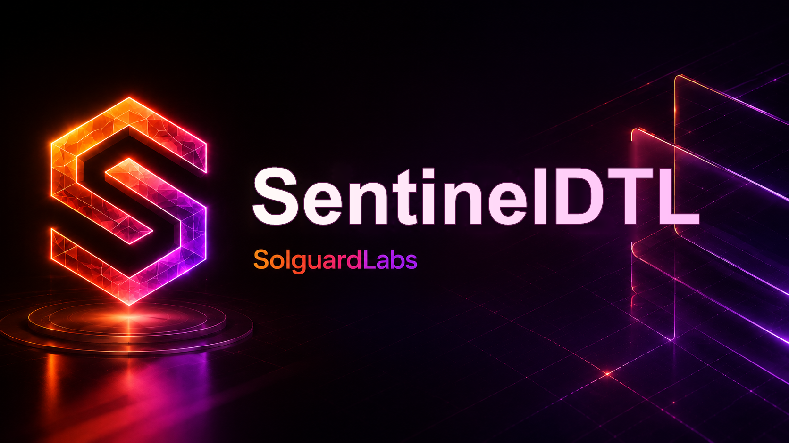

# SentinelDTL



SentinelDTL es un nucleo C para control determinista de riesgo en sesiones de
ejecucion. Modela pausas operativas, modo de proteccion, circuit breakers,
limites por sesion, colas de ordenes y estado de vault para flujos de salida de
unidades de riesgo.

El proyecto esta pensado como una base compacta de auditoria: todo el estado se
mantiene en memoria, la CLI produce JSON estable y los tests JavaScript validan
transiciones observables sin depender de servicios externos.

## Componentes

- `include/sentinel`: API publica del motor.
- `src/amount.c`: aritmetica entera con comprobaciones.
- `src/policy.c`: limites de sesion, cola y orden individual.
- `src/session.c`: contadores de sesion, pausas, reanudaciones y proteccion.
- `src/vault.c`: reservas, unidades emitidas, bloqueos y redenciones.
- `src/order.c`: ciclo de vida de ordenes admitidas.
- `src/engine.c`: coordinacion de cuentas, sesiones, ordenes y vault.
- `src/json.c`: salida JSON determinista para escenarios y tests.
- `src/scenario.c`: escenarios CLI reproducibles.
- `tests/node`: tests de integracion con `node:test`.

## Flujo operativo

1. El motor arranca con una politica de riesgo, un vault y cuentas registradas.
2. Una cuenta abre una sesion de ejecucion con limites de notional y cola.
3. Las ordenes se admiten contra el estado vigente del vault y quedan en cola.
4. El plano de control puede pausar el sistema para bloquear intake y ejecucion.
5. El plano de control puede reanudar el sistema y continuar la cola admitida.
6. El modo de proteccion bloquea nuevo intake y permite procesar trabajo ya
   admitido cuando la politica lo autoriza.
7. Cada escenario emite un snapshot JSON con cuentas, sesiones, ordenes,
   eventos y comprobaciones de conservacion.

## Requisitos

- Compilador C con soporte C11 (`cc`, `gcc`, `clang` o `cl`).
- Node.js `24` o superior.
- Bash para los scripts POSIX en `scripts/`.

En Windows, se recomienda usar Git Bash o MSYS2 para `scripts/*.sh`. Los tests
Node tambien pueden compilar el binario directamente si encuentran un
compilador en `PATH`.

## Uso

Compilar:

```bash
bash scripts/build.sh
```

Listar escenarios:

```bash
./build/sentineldtl --list
```

Ejecutar escenarios:

```bash
./build/sentineldtl baseline
./build/sentineldtl pause-resume
./build/sentineldtl limits
./build/sentineldtl protection
./build/sentineldtl batch
./build/sentineldtl treasury
./build/sentineldtl snapshot
```

Ejecutar tests:

```bash
npm test
```

Ejecutar pipeline completo:

```bash
npm run ci
```

Tambien se puede usar `make` en entornos compatibles:

```bash
make
make test
make ci
```

En entornos POSIX con Node y compilador disponibles en el mismo shell, el
pipeline bajo nivel es:

```bash
bash scripts/ci.sh
```

## Salida JSON

Cada escenario devuelve un objeto con:

- `scenario`: nombre normalizado del escenario.
- `mode`: estado del plano de control.
- `policy`: limites vigentes.
- `vault`: reservas, unidades, floor y version.
- `risk`: agregados de liquidez, cola, utilizacion y conservacion.
- `accounts`: saldos y unidades por cuenta.
- `sessions`: contadores de admision, ejecucion, pausa y proteccion.
- `orders`: estado de cada orden.
- `events`: log determinista de transiciones.
- `checks`: conservacion de caja y unidades.
- `last_error`: ultimo rechazo esperado dentro del escenario.

## Calidad

El pipeline local ejecuta:

- build C con `-std=c11 -Wall -Wextra -Werror`;
- chequeo de sintaxis JavaScript;
- tests de integracion Node;
- ejecucion de todos los escenarios CLI.

GitHub Actions llama a `bash scripts/ci.sh` en `push` y `pull_request`.
Dependabot esta configurado para GitHub Actions y ecosistema npm.

## Estado

SentinelDTL es una implementacion de referencia para entornos controlados,
simulacion de riesgo y ejercicios de revision. Cualquier adaptacion productiva
debe pasar por hardening de persistencia, autenticacion, observabilidad,
concurrencia y revision independiente.
